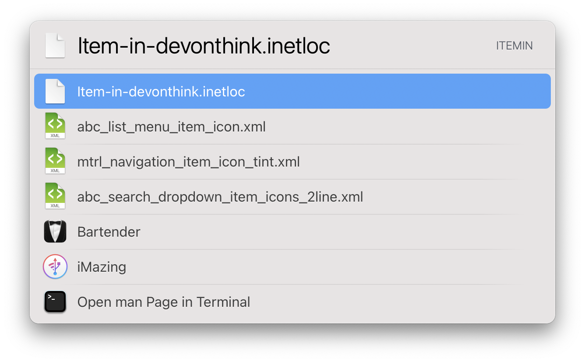

# DEVONthink Launchbar Search Tool
## What does it do?
The tool aims to let you search and navigate through DEVONthink effectively. It learns from your habit so that the items get hitted most will show at the top.

## How does it work?
Just enter the keyword and it will do a live and prefix search then nicely present the results for you.


## Create shortcuts for DEVONthink items!
It is a pitty that we cannot create direct entries for DEVONthink items in LaunchBar. We have to first open this action then search then select one... What if we can create a shortcut for the item and make it accessible directly from LaunchBar without using this tool.

Well, you can! Just press `⌘ + ⌥ + ↵` on that item.


Next time that item will be searchable directly from LaunchBar by its name.



You can later assign an [abbreviation](https://www.obdev.at/resources/launchbar/help/AbbreviationSearch.html) for it to access it faster.

## Requirements
This tool requires Python3 to be installed at the path `/usr/bin/python3`.
If you are using macOS Catalina or higher version, you can run this command in terminal
```
xcode-select --install
```
to install Python3.

See https://installpython3.com/mac/ for more details.

If you use homebrew or other ways to install Python3, make sure it is accessible via `/usr/bin/python3`.


### Modifier keys
If it is not a group:
- `⌘ + ↵` to reveal that item in DEVONthink
- `⇧ + ↵` to reveal that item in Finder
- `⌥ + ↵` to open that item externally

If it is a group:
- `⌘ + ↵` to reveal that item in DEVONthink
- `⌥ + ↵` to navigate through that group in Launchbar

Note that if you are already in "navigation mode", just press ↵ and you can navigate that group, press `⌥ + ↵` to open that group in DEVONthink.

### Excluded tag
If you tag a file/group `exclude-from-launchbar`, it will not be shown in the result.


## Config
You can adjust all those values in the config file `config.py`.


`config.py` file:

```python
# Do not change this class
class DefaultConfig:
    a = 0.8
    b = 0.5
    frequency_weight = 2
    excluded_tag = 'exclude-from-launchbar'
    max_result_num = 80 # Set to None to cancel the limit. Note that this may cause performance issue!
    shortcut_path = '~/Documents/Devonthink' # Set to None to disable shortcut creation


# change this one
class UserConfig(DefaultConfig):
    a = 0.8
    b = 0.5
    frequency_weight = 2
    excluded_tag = 'exclude-from-launchbar'
    max_result_num = 80
    shortcut_path = '~/Documents/Devonthink'


```
Do not change the `DefaultConfig` class. Instead change the properties of `UserConfig`.

The `max_result_num` option can be set to `None` so that all the results will be presented in LaunchBar. Note that too many results may cause performance issue!

## More details
### The "shorcuts"
As you may notice, the so-called shortcut is just a `inetloc` file created in your filesystem with the name and item link of the corresponding DEVONthink item. The default creation path is set to be `~/Documents/Devonthink`. You can change it to any other locations that you have write permission to. Set it to `None` will prevent the creation of any "shortcuts".

### Frequency score
Except for the search score given by DEVONthink, the tool will adjust that score based on the frequency you open items.

`final_score = search_score + weight * frequency_score`


How do the tool calcuate the `frequency_score`?

Every time you choose a item, it update the frequency score of every item appears using the following formula.

`frequency_score = old_score * a + (1 - a) * (1 if is_chosen else 0)`

The initial value is 0. The `frequency_score` is set to `b` (in config.py) the first time it is selected. Later if it is not selected, the score will decrease according the the formula. But it will not drop below `b`.

### Search query
The query template used is `name:({}) tags!={}`. So only the name is searched and the specific tag is excluded (default to `exclude-from-launchbar`). In more detail, each keyword entered is prepended with a `~`. For example, if the text you type in LaunchBar is `hello world`, then the actual query will be `name:(~hello ~world) tags!=exclude-from-launchbar`.

## Change log

2025-04-18 21:22 dave@davemee.com	butchered references to 'DEVONthink 3' to 'DEVONthink' so it runs on the beta 4 (and hopefully 5 onwards, which is stabilising on this name), set LaunchBar shortcut to 'sd'
